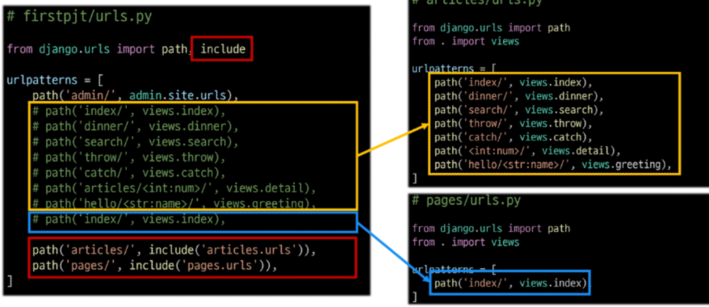

# Django URLs
### 요청과 응답에서 Django URLs의 역할
요청을 받으면 urls -> views로 전달
### URL dispatcher
#### URL 패턴을 정의하고 해당 패턴이 일치하는 요청을 처리할 view 함수를 연결(매핑)
### App URL mapping
#### 각 앱에 URL을 정의하는 것
#### 프로젝트와 각 앱이 URL을 나누어 관리를 편하게 하기 위함
### 2번째 앱 pages 생성 후 발생할 수 있는 문제
* view 함수 이름이 같거나 같은 패턴의 URL 주소를 사용하게 되는 경우
* 아래 코드와 같이 해결해 볼 수 있으나 더 좋은 방법이 필요
* "URL을 각자 app에서 관리하자"

### include()
#### 프로젝트 내부 앱들의 URL을 참조할 수 있도록 매핑하는 함수
#### URL의 일치하는 부분까지 잘라내고, 남은 문자열 부분은 후속 처리를 위해 include 된 URL로 전달
## URL 이름 지정
### url 구조 변경에 따른 문제점
* 기존 'articles/' 주소가 'articles/index/'로 변경됨에 따라 해당 주소를 사용하는 모든 위치를 찾아가 변경해야 함
* URL에 이름을 지어주면 이름만 기억하면 되지 않을까?
### Naming URL patterns 적용
#### path 함수의 name 키워드 인자를 정의
### URL 표기 변화
#### a 태그의 href 속성 값 뿐만 아니라 form의 action 속성처럼 url을 작성하는 모든 위치에서 변경
### 'url' tag
#### 주어진 URL 패턴의 이름과 일치하는 절대 경로 주소를 반환
## URL 이름 공간
### URL 이름 지정 후 남은 문제
* articles 앱의 url 이름과 pages 앱의 url 이름이 같은 상황
* 단순히 이름만으로는 완벽하게 분리할 수 없음
* 이름에 성(key)을 붙이자"
### 'app_name' 속성 지정
#### app_name 변수 값 설정
### URL tag의 최종 변화
#### 마지막으로 url 태그가 사용하는 모든 곳의 표기 변경하기
# Model
### Model을 통한 DB(데이터베이스) 관리
### Django Model
#### DB의 테이블을 정의하고 데이터를 조작할 수 있는 기능들을 제공
#### 테이블 구조를 설계하는 '청사진(blueprint)'
### model 클래스 작성
```py
# articles/models.py

class Article(models.Model):
  title = models.CharField(max_length = 10)
  content = models.TextField()
```
### model 클래스 살펴보기 (1/5)
#### 작성한 모델 클래스는 최종적으로 DB에 다음과 같은 테이블 구조 만듦
```py
# articles/models.py

class Article(models.Model):
  title = models.CharField(max_length = 10)
  content = models.TextField()
# id 필드는 Django가 자동 생성
```
### model 클래스 살펴보기 (2/5)
* django.db.models 모듈의 Model이라는 부모 클래스를 상속받음
* Model은 model에 관련된 모든 코드가 이미 작성 되어 있는 클래스
* 개발자는 가장 중요한 테이블 구조를 어떻게 설계할지에 대한 코드만 작성하도록 하기 위한 것 (상속을 활용한 프레임워크의 기능 제공)
### model 클래스 살펴보기 (3/5)
1. 클래스 변수명
  - 테이블의 각 "필드(열) 이름"
### model 클래스 살펴보기 (4/5)
2. model Field 클래스
  - 테이블 필드의 "데이터 타입"
### model 클래스 살펴보기 (5/5)
3. model Field 클래스의 키워드 인자 (필드 옵션)
  - 테이블 필드의 "제약조건" 관련 설정
### 제약 조건
#### 데이터가 올바르게 저장되고 관리되도록 하기 위한 규칙
ex) 숫자만 저장되도록, 문자가 100자 까지만 저장되도록 하는 등
## Migrations
#### model 클래스의 변경사항(필드 생성, 수정 삭제 등)을 DB에 최종 반영하는 방법
### Migrations 핵심 명령어 2가지
`$ python manage.py makemigrations`
model class를 기반으로 최종 설계도(migration) 작성<br>
`$ python manage.py migrate`
최종 설계도를 DB에 전달하여 반영
## 추가 Migrations
### 추가 모델 필드 작성(1/5)
```py
class Article(models.Model):
    title = models.CharField(max_length = 10)
    content = models.TextField()
    created_at = models.DateTimeField(auto_now_add= True)
    updated_at = models.DateTimeField(auto_now = True) 
```
### 추가 모델 필드 작성(2/5)
* 이미 기존 테이블이 존재하기 때문에 필드를 추가 할 때 필드의 기본 값 설정이 필요
* 1번은 현재 대화를 유지하면서 직접 기본 값을 입력 하는 방법
* 2번은 현재 대화에서 나간 후 models.py에 기본 값 관련 설정을 하는 방법
### 추가 모델 필드 작성(3/5)
* 추가하는 필드의 기본 값을 입력해야 하는 상황
* 날짜 데이터이기 때문에 직접 입력하기 보다 Django가 제안하는 기본 값을 사용하는 것을 권장
* 아무것도 입력하지 않고 enter를 누르면 Django가 제안하는 기본 값으로 설정 됨
### 추가 모델 필드 작성(4/5)
* migrations 과정 종료 후 2번째 migration 파일이 생성됨을 확인
* 이처럼 Django는 설계도를 쌓아가면서 추후 문제가 생겼을 시 복구하거나 되돌릴 수 있도록 함 (마치 'git commit'과 유사)
### 추가 모델 필드 작성(5/5)
* migrate 후 테이블 필드 변화 확인
`$ python manage.py migrate`
### model class에 변경사항(1)이 생겼다면, 반드시 새로운 설계도를 생성(2)하고, 이를 DB에 반영(3)해야 한다.
  1. model class 변경 -> 2. makemigrations -> 3. migrate
## 모델 필드
### Model Field
#### DB 테이블의 필드(열)을 정의하며, 해당 필드에 저장되는 데이터 타입과 제약조건을 정의
### CharField()
#### 길이의 제한이 있는 문자열을 넣을 때 사용 (필드의 최대 길이를 결정하는 max_length는 필수 인자)
### TextField()
#### 글자의 수가 많을 때 사용
### DataTimeField()
#### 날짜와 시간을 넣을 때 사용
### DateTimeField의 선택인자
#### auto_now : 데이터가 저장될 때마다 자동으로 현재 날짜시간을 저장
#### auto_now_add : 데이터가 처음 생성될 때만 자동으로 현재 날짜시간을 저장
## Admin site
### Automatic admin interface
#### Django는 추가 설치 및 설정 없이 자동으로 관리자 인터페이스를 제공
#### 데이터 확인 및 테스트 등을 진행하는데 매우 유용
### 1. admin 계정 생성
* email은 선택사항이기 때문에 입력하지 않고 진행 가능
* 비밀번호 입력 시 보안상 터미널에 출력되지 않으니 무시하고 입력 이어가기
`$ python manage.py createsuperuser`
### 2. DB에 생성된 admin 계정 확인
### 3. admin에 모델 클래스 등록
* admin.py에 작성한 모델 클래스를 등록해야만 admin site에서 확인 가능
### 4. admin site 로그인 후 등록된 모델 클래스 확인
### 5. 데이터 생성, 수정, 삭제 테스트
### 6. 테이블 확인
