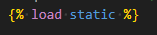
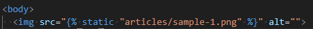
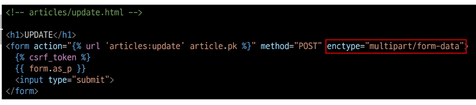
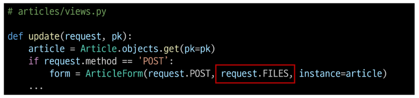

# Staic files
### Static Files
서버 측에서 변경되지 않고 고정적으로 제공되는 파일 (이미지, JS, CSS 파일 등)
### 웹 서버와 정적 파일(1/2)
* 웹 서버의 기본동작은 특정 위치(URL)에 있는 자원을 요청(HTTP request) 받아서 응답(HTTP response)을 처리하고 제공하는 것
### 웹 서버와 정적 파일(2/2)
* 이는 "자원에 접근 가능한 주소가 있다."라는 의미
* 웹 서버는 요청 받은 URL로 서버에 존재하는 정적 자원을 제공함
* 정적 파일을 제공하기 위한 경로(URL)가 있어야 함
## Static files 제공하기
1. 기본 경로에서 제공하기
2. 추가 경로에서 제공하기
### Static files 기본 경로
`app폴더/static`
### 기본 경로 static file 제공하기
* articles/static/articles/ 경로에 이미지 파일 배치
* static tag를 사용해 이미지 파일에 대한 경로 제공


### 사용자가 받으려면 반드시 url이 있어야 한다.
### STATIC_URL
기본 경로 및 추가 경로에 위치한 정적 파일을 참조하기 위한 URL
* 실제 파일이나 디렉토리가 아니며, URL로만 존재

### URL+STATIC_URL+정적파일 경로
---
http://127.0.0.1:8000/static/articles/sample-1.png
### Static files 추가 경로
---
STATICFILES_DIRS에 문자열 값으로 추가 경로 설정
### STATICFILES_DIRS
---
정적 파일의 기본 경로 외에 추가적인 경로 목록을 정의하는 리스트
### 추가 경로 static file 제공하기 (1/4)
* 임의의 추가 경로 설정
```py
# settings.py

STATICFILES_DIRS = [
  BASE_DIR / 'static',
]
```
### 추가 경로 static file 제공하기 (2/4)
* 추가 경로에 이미지 파일 배치
### 추가 경로 static file 제공하기 (3/4)
* static tag를 사용해 이미지 파일에 대한 경로 제공
```html
<!-- articles/index.html -->

```
### 추가 경로 static file 제공하기 (4/4)
* 이미지를 제공 받기 위해 요청하는 Request URL 확인
### 정적 파일을 제공하려면 요청에 응답하기 위한 URL 필요
## Media Files
사용자가 웹에서 업로드하는 정적 파일
### ImageField()
이미지 업로드에 사용하는 모델 필드
* ※ 이미지 객체가 직접 저장되는 것이 아닌 '이미지 파일의 경로'가 문자열로 DB에 저장
### 미디어 파일 제공을 위한 사전 준비
1. settings.py에 MEDIA_ROOT, MEDIA_URL 설정
2. 작성한 MEDIA_ROOT와 MEDIA_URL에 대한 url 지정
### MEDIA_ROOT
실제 미디어 파일들이 위치하는 디렉토리의 절대 경로
### MEDIA_URL
MEDIA_ROOT에서 제공되는 미디어 파일에 대한 주소를 생성 (STATIC_URL과 동일한 역할)
### MEDIA_ROOT와 MEDIA_URL에 대한 url 지정
업로드 된 파일을 제공하는 URL == settings.MEDIA_URL
위 URL을 통해 참조하는 파일의 실제 위치 == settings.MEDIA_ROOT
```py
# crud/urls.py

from django.conf import settings
from django.conf.urls.static import static

urlpatterns = [
  path('admin/', admin.site.urls),
  path('articles/', include('articles.urls')),
] + static(settings.MEDIA_URL, document_root = settings.MEDIA_ROOT)
```
### 이미지 업로드 (1/6)
* blank=True 속성을 작성해 빈 문자열이 저장될 수 있도록 제약 조건 설정
* 게시글 작성 시 이미지 없이 작성 할 수 있도록
### 이미지 업로드 (2/6)
* migration 진행
### 이미지 업로드 (3/6)
* form 요소의 enctype 속성 추가
`<form action="" method="POST" enctype='multipart/form-data'>`
### 이미지 업로드(4/6)
* view 함수에서 업로드 파일에 대한 추가 코드 작성
```py
# articles/views.py

def create(request):
    if request.method == 'POST':
        form = ArticleForm(request.POST,request.FILES)
```
### 이미지 업로드(5/6)
* 이미지 업로드 입력 양식 확인
### 이미지 업로드(6/6)
* 이미지 업로드 결과 확인
## 업로드 이미지 제공
### 업로드 이미지 제공하기(1/3)
* 'url' 속성을 통해 업로드 파일의 경로 값을 얻을 수 있음
* article.image.url
  - 업로드 파일의 경로
* article.image
  - 업로드 파일의 파일 이름
```html
<!-- articles/detail.html -->

```
### 업로드 이미지 제공하기(2/3)
* 업로드 이미지 출력 확인 및 MEDIA_URL 확인
### 업로드 이미지 제공하기(3/3)
* 이미지를 업로드하지 않은 게시물은 detail 템플릿을 렌더링 할 수 없음
* 이미지 데이터가 있는 경우만 이미지를 출력할 수 있도록 처리하기
```html
<!-- articles/detail.html -->
  
  
  
```
### 업로드 이미지 수정(1/2)
* 수정 페이지 form 요소에 enctype 속성 추가

### 업로드 이미지 수정(2/2)
* update view 함수에서 업로드 파일에 대한 추가 코드 작성
