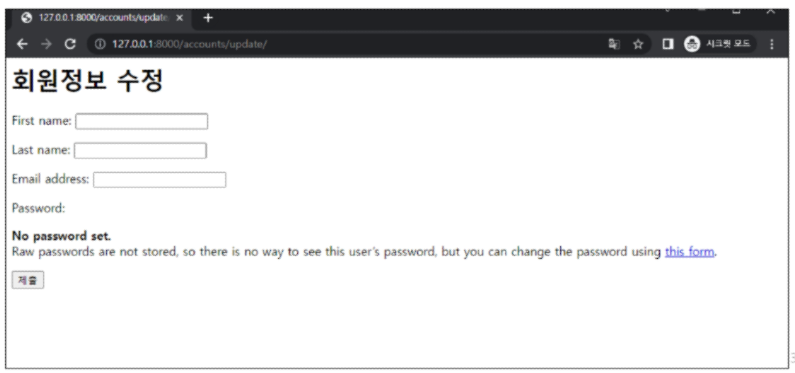
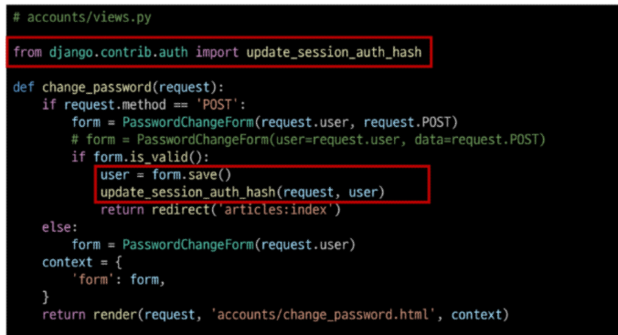
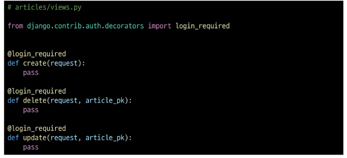
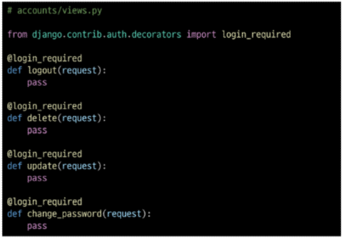

# Authentication System
## 회원 가입
### 회원 가입
User 객체를 Create 하는 과정
### UserCreationForm()
회원 가입시 사용자 입력 데이터를 받는 built-in ModelForm
### 회원 가입 페이지 작성 (1/2)
```py
# accounts/urls.py
    path('signup/', views.signup, name='signup'),
```
```html
<!-- accounts/signup.html -->
  <h1>회원가입</h1>
  <form action="" method="POST">
    
    {{ form.as_p }}
    <input type="submit">
```

```py
# accounts.views.py
def signup(request):
    if request.method == 'POST':
        form = UserCreationForm(request.POST)
        if form.is_valid():
            form.save()
            return redirect('articles:index')
    else:
        form = UserCreationForm()
    context = {
        'form' : form,
    }
    return render(request,'accounts/signup.html',context)
```
### 회원 가입 로직 에러
회원가입 진행 후 에러 페이지 확인
* Manager isn't available; 'auth.User' has been swapped for 'accounts.User'
* 회원 가입에 사용하는 UserCreationForm이 기존 유저 모델로 인해 작성된 클래스이기 때문
* 대체한 유저 모델로 변경 필요
### 커스텀 유저 모델을 사용하려면 다시 작성해야 하는 Form
### UserCreation Form / UserChangeForm
두 Form 모두 class Meta : model = User가 작성된 Form
### get_user_model()
"현재 프로젝트에서 활성화된 사용자 모델(active user model)"을 반환하는 함수
### User 모델을 직접 참조하지 않은 이유
* get_user_model()을 사용해 User 모델을 참조하면 커스텀 User 모델을 자동으로 반환해주기 때문
* Django는 필수적으로 User 클래스를 직접 참조하는 대신 get_user_model()을 사용해 참조해야 한다고 강조하고 있음
* User model 참조에 대한 자세한 내용은 추후에 다룰 예정
## 회원 탈퇴
### 회원 탈퇴
User 객체를 Delete 하는 과정
## 회원정보 수정
### 회원정보 수정
User 객체를 Update 하는 과정
### UserChangeForm()
회원정보 수정 시 사용자 입력 데이터를 받는 built-in ModelForm
### UserChangeForm 사용 시 문제점
* User 모델의 모든 정보들(fields)까지 모두 출력되어 수정이 가능하기 때문에 일반 사용자들이 접근해서는 안되는 정보는 출력하지 않도록 해야 함
* CustomUserChangeForm에서 접근 가능한 필드를 다시 조정
### CustomUserChangeForm 출력 필드 재정의 (1/2)
* User Model의 필드 목록 확인
```py
# accounts/forms.py
class CustomUserChangeForm(UserChangeForm):
    class Meta(UserChangeForm.Meta):
        model = get_user_model()
        fields = ('first_name','last_name','email')
```
### CustomUserChangeForm 출력 필드 재정의 (2/2)

## 비밀번호 변경
### 비밀번호 변경
인증된 사용자의 Session 데이터를 Update 하는 과정
### PasswordChangeForm()
비밀번호 변경 시 사용자 입력 데이터를 받는 built-in Form
### 비밀번호 변경 페이지 작성(1/3)
django는 비밀번호 변경 페이지를 회원정보 수정 form에서 별도 주소로 안내
### 비밀번호 변경 페이지 작성(2/3)
```py
# crud/urls.py

path('<int:user_pk>/password/',views.change_password,name= 'change_password'),
]
```
```html
<!-- accounts/change_password.html -->
  <h1>비밀번호 변경</h1>
  <form action="" method="POST">
    
    {{ form.as_p }}
    <input type="submit">
```
```py
# accounts/views.py
def change_password(request,user_pk):
    if request.method == 'POST':
        form = PasswordChangeForm(request.user, request.POST)
        if form.is_valid():
            form.save()
            return redirect('articles:index')
    else:
        # PasswordChangeForm은 첫번째 인자 user가 필수.
        form = PasswordChangeForm(request.user)
    context = {
        'form':form,
    }
    return render(request, 'accounts/change_password.html',context)
```
## 세션 무효화 방지하기
### 암호 변경 시 세션 무효화
* 비밀번호가 변경되면 기존 세션과의 회원 인증 정보가 일치하지 않게 되어 버려 로그인 상태가 유지되지 못하고 로그아웃 처리됨
* 비밀번호가 변경되면서 기존 세션과의 회원 인증 정보가 일치하지 않기 때문
### update_session_auth_hash(request, user)
암호 변경 시 세션 무효화를 막아주는 함수
* 암호가 변경되면 새로운 password의 Session Data로 기존 session을 자동으로 갱신

## 인증된 사용자에 대한 접근 제한
### 로그인 사용자에 대해 접근을 제한하는 2가지 방법
1. is_authenticated 속성 (attribute)
2. login_required 데코레이터 (decorator)
### is_authenticated
사용자가 인증 되었는지 여부를 알 수 있는 User model의 속성
* 모든 User 인스턴스에 대해 항상 True인 읽기 전용 속성이며, 비인증 사용자에 대해서는 항상 False
### is_authenticated 적용하기 (1/2)
로그인과 비로그인 상태에서 화면에 출력되는 링크를 다르게 설정하기
### is_authenticated 적용하기 (2/2)
인증된 사용자라면 로그인/회원가입 로직을 수행할 수 없도록 하기
```py
# accounts/views.py

def login(request):
  if request.user.is_authenticated:
    return redirect('articles:index')

def signup(request):
  if request.user.is_authenticated:
    return redirect('articles:index')
```
### login_required
인증된 사용자에 대해서만 view 함수를 실행시키는 데코레이터
* 비인증 사용자의 경우 /accounts/login 주소로 redirect 시킴
### login_required 적용하기 (1/2)
인증된 사용자만 게시글을 작성/수정/삭제 할 수 있도록 수정

### login_required 적용하기 (1/2)
인증된 사용자만 로그아웃/탈퇴/수정/비밀번호 변경 할 수 있도록 수정

### 탈퇴와 함께 기존 사용자의 Session Data 삭제 방법
* 사용자 객체 삭제 이후 로그아웃 함수 호출
* 단 "탈퇴(1) 후 로그아웃(2)"의 순서가 바뀌면 안됨
* 먼저 로그아웃이 진행되면 해당 요청 객체 정보가 없어지기 때문에 탈퇴에 필요한 유저 정보 또한 없어지기 때문
```py
# accounts/views.py

def delete(request):
  request.user.delete()
  auth_logout(request)
```