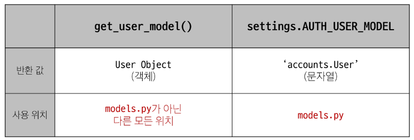
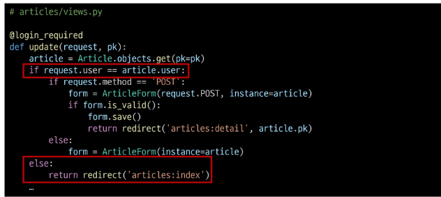
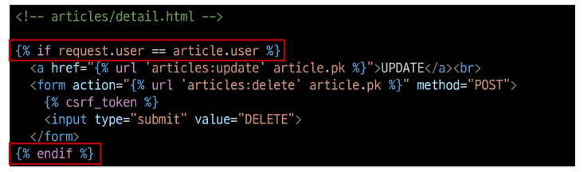

# Many to one relationships 2
### User와 다른 모델 간의 모델 관계 설정
1. User & Article
2. User & Comment
### Article(N) - User(1)
0개 이상의 게시글은 1명의 회원에 의해 작성 될 수 있다.
### Comment(N) - User(1)
0개 이상의 댓글은 1명의 회원에 의해 작성 될 수 있다.
## Article & User
### Article - User 모델 관계 설정
* user 외래 키 정의
### User 모델을 참조하는 2가지 방법 (1/2)
#### get_user_model()
#### settings.AUTH_USER_MODEL
### User 모델을 참조하는 2가지 방법 (2/2)
django프로젝트 '내부적인 구동 순서'와 '반환 값'에 따른 이유
#### 기억할 것은 User 모델은 직접 참조하지 않음

### Migration(1/4)
* 기존에 테이블이 있는 상황에서 필드를 추가 하려하기 때문에 발생하는 과정
* 기본적으로 모든 필드에는 NOT NULL 제약 조건이 있기 때문에 데이터가 없이는 새로운 필드가 추가되지 못함
* '1'을 입력하고 Enter 진행 (다음 화면에서 직접 기본 값 입력)
### Migration(2/4)
* 추가하는 외래 키 필드에 어떤 데이터를 넣을 것인지 직접 입력해야 함
* 마찬가지로 '1'을 입력하고 Enter 진행
* 기존에 작성된 게시글이 있다면 모두 1번 회원이 작성한 것으로 처리됨
### Migration(3/4)
* migrations 파일 생성 후 migrate 진행
### Migration(4/4)
* articles_article 테이블에 user_id 필드 생성 확인
### 게시글 Create (1/5)
* 기존 ArticleForm 출력 변화 확인
* User 모델에 대한 외래 키 데이터 입력을 받기 위해 불필요한 input이 출력
### 게시글 Create (2/5)
* ArticleForm 출력 필드 수정
```py
# articles/forms.py

class ArticleForm(forms.ModelForm):
  class Meta:
    model = Article
    fields = ('title', 'content',)
```
### 게시글 Create (3/5)
* 게시글 작성 시 에러 발생
* user_id 필드 데이터가 누락되었기 때문
### 게시글 Create (4/5)
* 게시글 작성 시 작성자 정보가 함께 저장될 수 있도록 save의 commit 옵션 활용
### 게시글 READ
* 각 게시글의 작성자 이름 출력
### 게시글 UPDATE (1/2)
* 본인의 게시글만 수정 할 수 있도록 하기
  - 게시글 수정 요청 사용자와 게시글 작성 사용자를 비교

### 게시글 UPDATE (2/2)
* 해당 게시글의 작성자가 아니라면, 수정 삭제 버튼을 출려가지 않도록 하기

### 게시글 DELETE
* 본인의 게시글만 삭제 할 수 있도록 하기
  - 삭제를 요청하려는 사용자와 게시글을 작성한 사용자를 비교
## 모델 관계 설정
### Comment - User 모델 관계 설정
* user 외래 키 정의
### Migration(1/2)
* 이전에 Article와 User 모델 관계 설정 때와 동일한 상황
* 기존 Comment 테이블에 새로운 필드가 빈 값으로 추가 될 수 없기 때문에 기본 값 설정 과정이 필요
### Migration(2/2)
* Migration 후 comment 테이블에 생성된 user_id 필드 확인
### 댓글 CREATE(1/3)
* 댓글 작성 시 이전에 게시글 작성 할 때와 동일한 에러 발생
* 댓글의 user_id 필드 데이터가 누락되었기 때문
### 댓글 CREATE(2/3)
* 댓글 작성 시 작성자 정보가 함께 저장할 수 있도록 작성
### 댓글 CREATE(3/3)
* 댓글 작성 후 테이블 확인
### 댓글 READ
* 댓글 출력 시 댓글 작성자와 함께 출력
```html

      <li>
        {{comment.user}}-{{ comment.content }}
        
```
### 댓글 DELETE (1/2)
* 본인의 댓글만 삭제 할 수 있도록 하기
```py
# articles/views.py

def comments_delete(request,article_pk,comment_pk):
  comment = Comment.objects.get(pk=comment_pk)
  if request.user == comment.user:
    comment.delete()
  return redirect('articles:detail', article_pk)
```
### 댓글 DELETE (2/2)
* 해당 댓글의 작성자가 아니라면, 댓글 삭제 버튼을 출력하지 않도록 함
```html
 
      <li>
        {{comment.user}}-{{ comment.content }}
        
          <form action="" method="POST" style="display: inline;">
          
          <input type="submit" value="삭제">
        </form>
        
      </li>
     
```
### 인증된 사용자만 댓글 작성 및 삭제
```py
# articles/views.py
@login_required
def comments_create(request,pk):
  pass

@login_required
def comments_delete(request,article_pk, comment_pk):
  pass
```