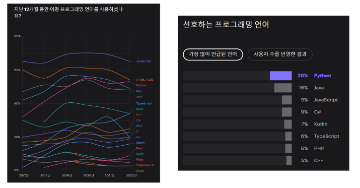
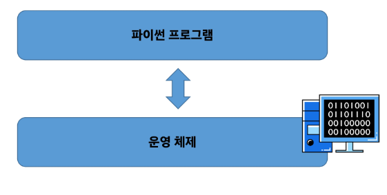

# <프로그래밍>
## 프로그램 
### 명령어들의 집합
* ex) 친구에게 우리 집으로 오는 길을 적어줌 -> 프로그램 작성
* 적어준 길을 순대로 따라감 -> 프로그램 실행
* 컴퓨터는 더 다양한 연산 집합을 가진다.
* 기존 연산을 통해 더 많은 연산을 만들 수 있다.
* 이전에 사용한 연산 위에 차곡차곡 쌓여 새로운 연산을 만들어 냄

## 프로그래밍의 핵심:
새 연산을 정의하고 조합해 유용한 작업을 수행하는 것 -> '문제를 해결'하는 매우 강력한 방법
## 프로그래밍 언어
컴퓨터에게 작업을 지시하고 문제를 해결하는 도구
## Python

### 파이썬을 이용하는 이유
* 간결하고 읽기 쉬운 문법
* 다양한 응용 분야
    * 데이터 분석, 인공지능, 웹 개발, 자동화 등
* 파이썬 커뮤니티의 지원
    * 세계적인 규모의 풍부한 온라인 포럼 및 커뮤니티 생태계
### 파이썬 프로그램이 실행되는 법
    * 컴퓨터는 기계어로 소통하기 때문에 사람이 기계어를 직접 작성하기 어려움
    * 인터 프리터가 사용자의 명령어를 운영체제가 이해하는 언어로 바꿈

### 파이썬 인터프리터를 사용하는 2가지 방법
1. shell 이라는 프로그램으로 한 번에 한 명령어 씩 입력해서 실행
2. 확장자가 .py인 파일에 작성된 파이썬 프로그램을 실행
