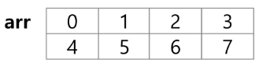

# 2차원 배열
### 2차원 배열의 선언
**[행][렬]**
* 1차원 List를 묶어놓은 List
* 2차원 이상의 다차원 List는 차원에 따라 Index를 선언
* 2차원 List의 선언 : 세로길이(행의 개수), 가로길이(열의 개수)를 필요로 함
* Python에서는 데이터 초기화를 통해 변수선언과 초기화가 가능함<br>
`arr = [[0,1,2,3],[4,5,6,7]]`(2행 4열의 2차원 List)

### [참고]
3<br>
1 2 3<br>
4 5 6<br>
```py
N = int(input)
arr = [list(map(int,input().split())) for _ in range(N)]
```
3<br>
123<br>
456<br>
```py
N = int(input())
arr = [list(map(int,input())) for _ in range(N)]
```
### 배열 순회
* n X m 배열의 n*m 개의 모든 원소를 빠짐없이 조사하는 방법
### 행 우선 순회
```py
# i 행의 좌표
# j 열의 좌표
for i in range(n):
    for j in range(m):
        f(array[i][j]) # 필요한 연산 수행
# 먼저 고정한 변수 앞에 쓰면 행 우선 순회
```
### 열 우선 순회
```py
# i 행의 좌표
# j 열의 좌표
for j in range(m):
    for i in range(n):
        f(array[i][j]) # 필요한 연산 수행
# 먼저 고정한 변수 뒤에 쓰면 열 우선 순회
```
### 지그재그 순회
```py
# i 행의 좌표
# j 열의 좌표
for i in range(n):
    for j in range(m):
        arr[i][j + (m-1-2*j) * (i%2)]
# i%2 : 짝수행에서는 날려서 원래대로 진행

```


### 델타를 이용한 2차 배열 탐색
* 2차 배열의 한 좌표에서 4방향의 인접 배열 요소를 탐색하는 방법
* 인덱스 (i,j)인 칸의 상하좌우 칸(ni,nj)
* 결과가 범위 내에 있는지 반드시 체크!
```py
di[] <- [0,1,0,-1] # 방향별로 더할 값
dj[] <- [1,0,-1,0]

for k : 0 -> 3
    ni <- i + di[k]
    nj <- j + dj[k]
```
```py
N = 5
arr = [[0]*N for _ in range(N)]
di = [0,1,0,-1]
dj = [1,0,-1,0]
for i in range(N):
    for j in range(N):
        for k in range(4):
            ni = i + di[k]
            nj = j + dj[k]
            if 0<=ni<N and 0<=nj<N:
                print(arr[ni][nj], end=' ')
        print()
```
### 전치 행렬
```py
# i : 행의 좌표, len(arr)
# j : 열의 좌표, len(arr[0])
arr = [[1,2,3],[4,5,6],[7,8,9]] # 3x3 행렬

for i in range(3):
    for j in range(3):
        if i<j:
            arr[i][j], arr[j][i] = arr[j][i], arr[i][j]
```
### zip 함수 
```py
list(zip(*arr))
# zip : 같은 인덱스끼리 묶어서 반환 
```
### 부분집합 합 (Subset Sum) 문제
### 유한 개의 정수로 이루어진 집합이 있을 때, 이 집합의 부분집합 중에서 그 집합의 원소를 모두 더한 값이 0이 되는 경우가 있는지를 알아내는 문제
### 예를 들어, [-7,-3,-2,5,8]라는 집합이 있을 때, [-3,-2,5]는 이 집합의 부분집합이면서 (-3)+(-2)+5 = 0이므로 이 경우의 답은 참이 된다.
### 완전검색 기법으로 부분집합 합 문제를 풀기 위해서는, 우선 집합의 모든 부분집합을 생성한 후에 각 부분집합의 합을 계산해야 한다.
### 주어진 집합의 부분집합을 생성하는 방법에 대해서 생각해보자
### 부분집합의 수
* 집합의 원소가 n개일 때, 공집합을 포함한 부분집합의 수는 2^n개이다.
* 이는 각 원소를 부분집합에 포함시키거나 포함시키지 않는 2가지 경우를 모든 원소에 적용한 경우의 수와 같다.
* 예) {1,2,3,4} (2x2x2x2 = 16가지)
### 각 원소가 부분집합에 포함되었는지를 loop 이용하여 확인하고 부분집합을 생성하는 방법
```py
bit = [0,0,0,0]
for i in range(2):
    bit[0] = i # 0번 원소
    for j in range(2) :
        bit[1] = j # 1번 원소
        for k in range(2):
            bit[2] = k # 2번 원소
            for l in range(2):
                bit[3] = l
                print_subset(bit) # 생성된 부분집합 출력
```
### 비트 연산자
* & : 비트 단위로 AND 연산을 한다.
* | : 비트 단위로 OR 연산을 한다.
* << : 피연산자의 비트 열을 왼쪽으로 이동시킨다.
* \>> : 피연산자의 비트 열을 오른쪽으로 이동시킨다.
### <<연산자
* 1 << n : 2^n 즉, 원소가 n 개일 경우의 모든 부분집합의 수를 의미한다.
### &연산자
* i & (1<<j) : i의 j번째 비트가 1인지 아닌지를 검사한다.
### 보다 간결하게 부분집합을 생성하는 방법
* Python 코드 예
```py
arr = [3,6,7,1,5,4]

n = len(arr) # n : 원소의 개수

for i in range(1<<n) : # 1<<n : 부분 집합의 개수
    for j in range(n): # 원소의 수만큼 비트를 비교함
        if i & (1<<j):
            print(arr[j], end=",")
    print()
print()
```
### 부분집합 합 문제 구현하기
* 10개의 정수를 입력 받아 부분집합의 합이 0이 되는 것을 존재하는지를 계산하는 함수를 작성해보자
* -7 -5 2 3 8 -2 4 6 9
```py
def f(arr,N):
    for i in range(1,1 << N):
        s = 0
        for j in range(N):
            if i & (1 << j):
                s += arr[j]
        #         print(arr[j], end=' ')
        # print(s)
        if s == 0:
            return True
    return False

# Subset sum
N = int(input())
arr = list(map(int,input().split()))
print(f(arr,N))
```