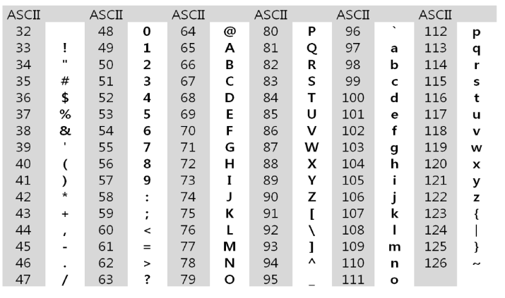

# String
### 컴퓨터에서의 문자표현
* 글자 A를 메모리에 저장하는 방법에 대해서 생각해보자
* 물론 칼로 A라는 글자를 새기는 방식은 아닐 것이다. 메모리는 숫자만을 저장할 수 있기 때문에 A라는 글자의 모양 그대로 비트맵으로 저장하는 방법을 사용하지 않는 한(이 방법은 메모리 낭비가 심하다) 각 문자에 대해서 대응되는 숫자를 정해 놓고 이것을 메모리에 저장하는 방법이 사용될 것이다.
* 영어가 대소문자 합쳐서 52이므로 6(64가지)비트면 모두 표현할 수 있다. 이를 코드체계라고 한다.
### 그런데 네트워크가 발전되기 전 미국의 각 지역 별로 코드체계를 정해놓고 사용했지만 <br> 네트워크(인터넷: 인터넷은 미국에서 발전했다)이 발전하면서 서로간에 정보를 주고 받을 때 정보를 달리 해석한다는 문제가 생겼다.
### 그래서 혼동을 피하기 위해 표준안을 만들기로 했다.
### 바로 이러한 목적으로 1967년, 미국에서 ASCII(American Standard Code for Information Interchange)라는 문자 인코딩 표준이 제정되었다.
### ASCII는 7bit 인코딩으로 128문자를 표현하며 33개의 출력 불가능한 제어 문자들과 공백을 비롯한 95개의 출력 가능한 문자들로 이루어져 있다.
### 확장 아스키는 표준 문자 이외의 악센트 문자, 도형 문자, 특수 문자, 특수 기호 등 부가적인 문자를 128개 추가할 수 있게 하는 부호이다.
* 표준 아스키는 7bit를 사용하여 문자를 표현하는 데 비해 확장 아스키는 1Byte 내의 8-bit를 모두 사용함으로써 추가적인 문자를 표현할 수 있다.
* 컴퓨터 생산자와 소프트웨어 개발자가 여러 가지 다양한 문자에 할당할 수 있도록 하고 있다. 이렇게 할당된 확장 부호는 표준 아스키와 같이 서로 다른 프로그램이나 컴퓨터 사이에 교환되지 못한다.
* 그러므로 표준 아스키는 마이크로컴퓨터 하드웨어 및 소프트웨어 사이에서 세계적으로 통용되는 데 비해, 확장 아스키는 프로그램이나 컴퓨터 또는 프린터가 그것을 해독할 수 있도록 설계되어 있어야만 올바로 해독될 수 있다.
### 오늘날 대부분의 컴퓨터는 문자를 읽고 쓰는데 ASCII형식을 사용한다.
### 그런데 컴퓨터가 발전하면서 미국 뿐 아니라 각 나라에서도 컴퓨터가 발전했으며 각 국가들은 자국의 문자를 표현하기 위하여 코드체계를 만들어서 사용하게 되었다.
* 우리나라도 아주 오래된 이야기지만 한글 코드체계를 만들어 사용했고 조합형, 완성형 두 종류를 가지고 있었다.
### 인터넷이 전 세계로 발전하면서 ASCII를 만들었을 때의 문제와 같은 문제가 국가간에 정보를 주고 받을 때 발생했다.
### 자국의 코드체계를 타 국가가 가지고 있지 않으면 정보를 잘못 해석 할 수 밖에 없었다.
### 그래서 다국어 처리를 위해 표준을 마련했다 이를 유니코드라고 한다.
### 유니코드도 다시 Character Set으로 분류된다.
* UCS-2(Universal Character Set 2)
* UCS-4(Universal Character Set 4)
* 유니코드를 저장하는 변수의 크기를 정의
* 그러나, 바이트 순서에 대해서 표준화하지 못했음
* 다시 말해 파일을 인식 시 이 파일이 UCS-2, UCS-4인지 인식하고 각 경우를 구분해서 모두 다르게 구현해야 하는 문제 발생
* 그래서 유니 코드의 적당한 외부 인코딩이 필요하게 되었다.
### 유니코드 인코딩(UTF: Unicode Transformation Format)
* UTF-8 (in web) <br>
-MIN : 8bit, Max:32bit(1 Byte*4)
* UTF-16 (in windows, java) <br>
-MIN : 16bit, Max:32bit(2 Byte*2)
* UTF-32 (in unix) <br>
-MIN : 32bit, MAX:32bit(4 Byte*1)
### Python 인코딩
* 2.x 버전 - ASCII -> #-*- coding: utf-8 - *-(첫 줄에 명시)
* 3.x 버전 - 유니코드 UTF-8 -> 생략가능
* 다른 인코딩 방식으로 처리 시 첫 줄에 작성하는 위 항목에 원하는 인코딩 방식을 지정해주면 됨
### C언어에서 문자열 처리
* 문자열은 문자들의 배열 형태로 구현된 응용 자료형
* 문자배열에 문자열을 저장할 때는 항상 마지막에 끝을 표시하는 널문자('\0')를 넣어줘야 한다.
`char ary[] = {'a','b','c','\0'}; // 또는 char ary[] = "abc"`
* 문자열 처리에 필요한 연산을 함수 형태로 제공한다.
* `strlen(),strcpy(),strcmp(), ...`
### 다음 두 코드의 차이 이해하기 
s1 = list(input()) <br>
s2 = input()
### strlen() 함수 만들어 보기
def strlen(a) : # '\0'을 만나면 '\0'을 제외한 글자수를 리턴
### C와 Java의 String 처리의 기본적인 차이점
* c는 아스키 코드로 저장
* java는 유니코드로 저장
* 파이썬은 유니코드로 저장
## 문자열 뒤집기
### 자기 문자열에서 뒤집는 방법이 있고 새로운 빈 문자열을 만들어 소스의 뒤에서부터 읽어서 타겟에 쓰는 방법이 있겠다.
### 자기 문자열을 이용할 경우는 swap을 위한 임시 변수가 필요하며 반복 수행을 문자열 길이의 반만을 수행해야 한다.
### 파이썬에서 문자열 뒤집기
```py
s = 'Reverse this strings'
s = s[::-1]
s = 'abcd'
s = list(s)
s.reverse()
s = ''.join(s)
```
### c strcmp() 함수를 제공
### Java에서는 equals() 메소드를 제공한다,
* 문자열 비교에서 == 연산은 메모리 참조가 같은지를 묻는 것
* 파이썬에서는 ==연산자와 is 연산자를 제공한다.
*  == 연산자는 내부적으로 특수 메서드 `_eq_()`를 호출
```py
s1 = 'abc'
s2 = 'abc'
print(s1 == s2) # True
print(s1 is s2) # True
s3 = s1[:2] + 'c' # 새롭게 생성
print(s3) # abc 
print(s1 == s3) # True
print(s1 is s3) # False
```
### 문자열 숫자를 정수로 변환하기 
### C 언어에서는 atoi()함수를 제공한다. 역 함수로는 itoa()가 있다.
### java에서는 숫자 클래스의 parse 메소드를 제공한다.
* 예 : Integer.paseInt(String)
* 역함수로는 toString() 메소드를 제공한다.
### 파이썬에서는 숫자와 문자변환 함수를 제공한다.
ex) int("123"), float("3.14"), str(123), repr(123)
### int()와 같은 atoi()함수 만들기
```py
def atoi(s):
    i = 0
    for x in s:
        i = i*10 + ord(x) - ord('0')
    return i
```
