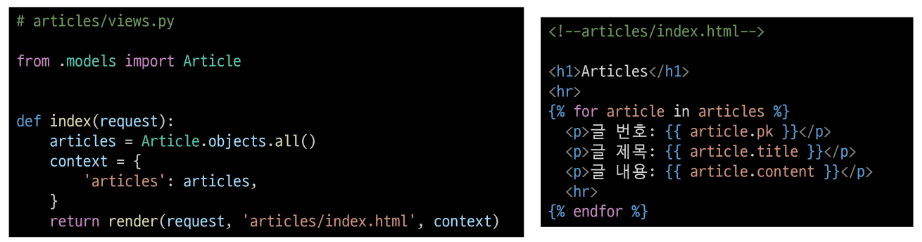
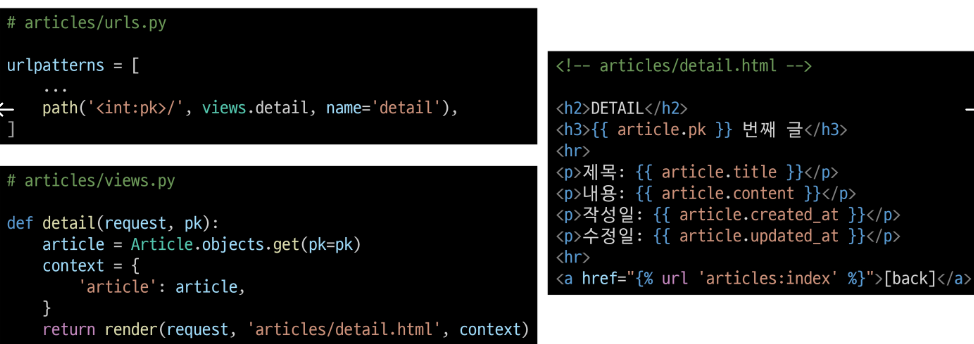
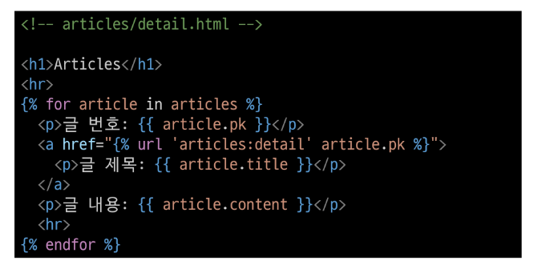
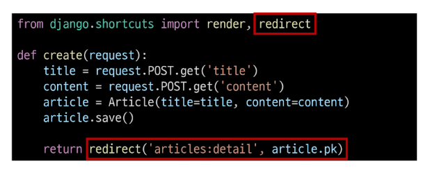

# Django ORM with view
### Django shell에서 연습했던 QuerySet API를 직접 view 함수에서 사용하기
## Read
### 2가지 Read(조회) 진행
1. 전체 게시글 조회
2. 단일 게시글 조회

## Create
### Create 로직을 구현하기 위해 필요한 view 함수의 개수는?
#### 사용자 입력 데이터를 받을 페이지를 렌더링: new
#### 사용자가 입력한 데이터를 받아 DB에 저장 : create
## HTTP request methods
### HTTP
네트워크 상에서 데이터를 주고 받기위한 약속
### HTTP request methods
데이터(리소스)에 어떤 요청(행동)을 원하는지를 나타내는 것
### 'GET' Method
 특정 리소스를 조회하는 요청 (데이터를 전달할 때 URL에서 Query String)형식으로 보내짐
### 'POST' Method
특정 리소스에 변경(생성, 수정, 삭제)을 요구하는 요청
### HTTP response status code
특정 HTTP 요청이 성공적으로 완료되었는지를 3자리 숫자로 표현하기로 약속한 것
### 403 Forbidden
서버에 요청이 전달되었지만, 권한 때문에 거절되었다는 것을 의미
### 거절 된 이유
"CSRF token이 누락되었다" 라는 응답
### CSRF
Cross-Site-Request-Forgery
* "사이트 간 요청 위조"
* 사용자가 자신의 의지와 무관하게 공격자가 의도한 행동을 하여 특정 웹 페이지를 보안에 취약하게 하거나 수정, 삭제 등의 작업을 하게 만드는 공격 방법
### CSRF Token 적용
* DTL의 csrf_token 태그를 사용해 손쉽게 사용자에게 토큰 값 부여 가능
* 요청시 토큰 값도 함께 서버로 전송될 수 있도록 하는 것
### 요청 시 CSRF Token을 함께 보내야 하는 이유
* Django 서버는 해당 요청이 DB에 데이터를 하나 생성하는(DB에 영향을 주는) 요청에 대해 "Django가 직접 제공한 페이지에서 요청을 보낸 것인지"에 대한 확인 수단이 필요한 것
* 겉모습이 똑같은 위조 사이트나 정상적이지 않은 요청에 대한 방어 수단
* 기존
  - 요청 데이터 -> 게시글 작성
* 변경
  _ 요청 데이터 + 인증 토큰 -> 게시글 작성
### 그런데 왜 POST일 때만 Token을 확인할까?
* POST는 단순 조회를 위한 GET과 달리 특정 리소스에 변경 (생성, 수정, 삭제)을 요구하는 의미와 기술적인 부분을 가지고 있기 때문
* DB에 조작을 가하는 요청은 반드시 인증 수단이 필요
* 데이터베이스에 대한 변경사항을 만드는 요청이기 때문에 토큰을 사용해 최소한의 신원 확인을 하는 것
### 게시글 작성 결과
* 게시글 생성 후 개발자 도구를 사용해 Form Data가 전송되는 것 확인
* 더 이상 URL에 Query String 형태로 보냈던 데이터가 표기되지 않음
## redirect
### 게시글 작성 후 완료를 알리는 페이지를 응답하는 것
게시글을 "조회해줘!"라는 요청이 아닌 "작성해줘!"라는 요청이기 때문에 게시글 저장 후 페이지를 응답하는 것은 POST 요청에 대한 적절한 응답이 아님
### 데이터 저장 후 페이지를 주는 것이 아닌 다른 페이지로 사용자를 보내야 한다.
### redirect()
클라이언트가 인자에 작성된 주소로 다시 요청을 보내도록 하는 함수
### redirect() 함수 적용

### redirect 특징
* 해당 redirect에서 클라이언트는 detail url로 요청을 다시 보내게 됨
* 결과적으로 detail view 함수가 호출되어 detail view 함수의 반환 결과인 detail 페이지를 응답 받음
* 결국 사용자는 게시글 작성 후 작성된 게시글의 detail 페이지로 이동하는 것으로 느끼게 되는 것
### 게시글 작성 결과
* 게시글 작성 후 생성 된 게시글의 detail 페이지로 redirect 되었는지 확인
* create 요청 이후에 detail로 다시 요청을 보냈다는 것을 알 수 있음
