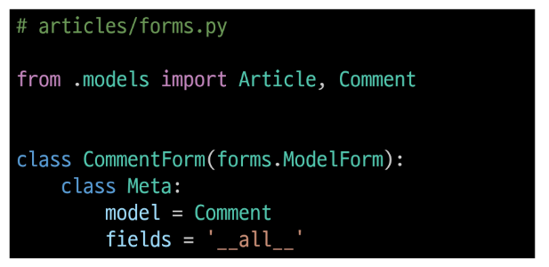
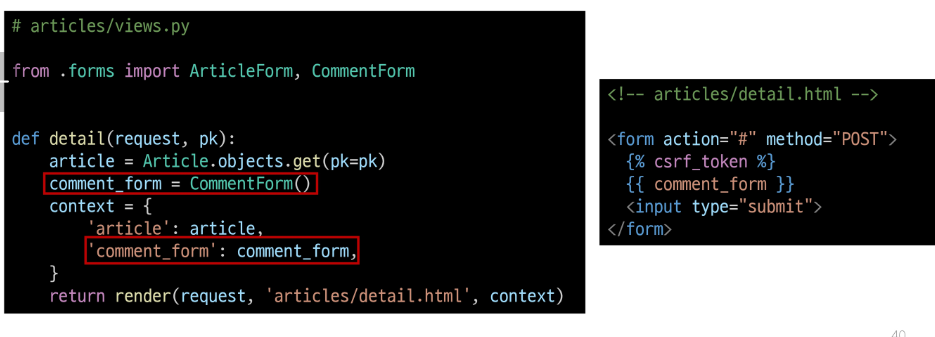
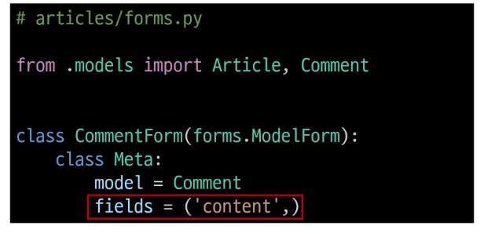
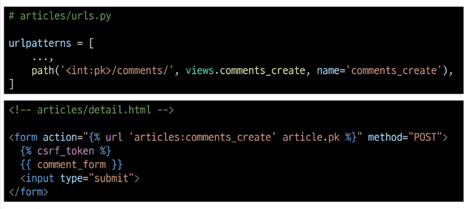
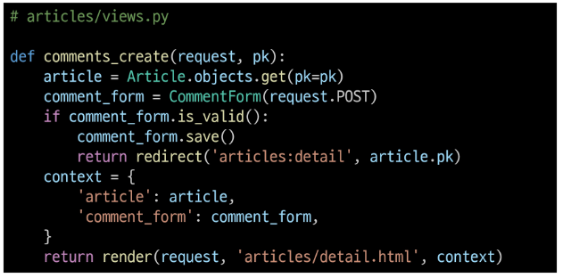
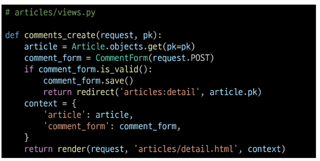
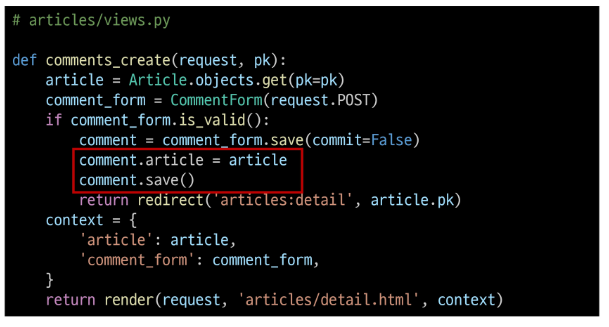

# Many to one relationships 1
### Many to one relationships (N:1 or 1:N)
한 테이블의 0개 이상의 레코드가 다른 테이블의 레코드 한 개와 관련된 관계
### Comment(N) - Article(1)
0개 이상의 댓글은 1개의 게시글에 작성될 수 있다.
#### Article에 대한 외래키는 Comment(N) 쪽에 생성
### ForeignKey()
N:1 관계 설정 모델 필드
### 댓글 모델 정의
* ForeignKey 클래스의 인스턴스 이름은 참조하는 모델 클래스 이름의 단수형으로 작성하는 것을 권장
* 외래 키는 ForeignKey 클래스를 작성하는 위치와 관계없이 테이블 필드 마지막에 생성됨
### ForeignKey(to, on_delete)
to : 참조하는 모델 class 이름<br>
on_delete : 외래 키가 참조하는 객체(1)가 사라졌을 때, 외래 키를 가진 객체(N)를 어떻게 처리할 지를 정의하는 설정 (데이터 무결성)
### on_delete의 'CASCADE'
* 부모 객체(참조 된 객체)가 삭제 됐을 때 이를 참조하는 객체도 삭제
### Migration 이후 댓글 테이블 확인
* 댓글 테이블의 article_id 필드 확인
* '참조 대상 클래스 이름' + '_' + '클래스 이름'
  * 참조하는 클래스 이름의 소문자로 작성하는 것이 권장되었던 이유
### 댓글 생성 연습 (1/7)  
shell_plus 실행 및 게시글 작성
```py
$ python manage.py shell_plus

# 게시글 생성
Article.objects.create(title='title', content = 'content')
```
### 댓글 생성 연습 (2/7)  
댓글 생성
```py
# Comment 클래스의 인스턴스 comment 생성
comment = Comment()
# 인스턴스 변수 저장
comment.content = 'first comment'
# DB에 댓글 저장
comment.save()
# 에러 발생
django.db.utils.IntegrityError : NOT NULL constraint failed:
articles_comment.article_id
# articles_comment 테이블의 ForeignKeyField, article_id 값이 저장 시 누락되었기 때문
```
### 댓글 생성 연습 (3/7)
shell_plus 실행 및 게시글 작성
```py
# 게시글 조회
article = Article.objects.get(pk=1)

# 외래 키 데이터 입력
comment.article = article
# 또는 comment.article_id = article.pk 처럼 pk 값을 직접 외래 키 컬럼에 넣어줄 수도 있지만 권장하지 않음

# 댓글 저장 및 확인
comment.save()
```
### 댓글 생성 연습 (4/7)
comment 인스턴스를 통한 article 값 참조하기
```py
comment.pk
=> 1
comment.content
=> 'first comment'
# 클래스 변수명인 article 로 조회 시 해당 참조하는 게시물 객체를 조회할 수 있음
comment.article
=> <Article: Article obejct (1)>

# article_pk는 존재하지 않은 필드이기 때문에 사용 불가
comment.article_id
=> 1
```
### 댓글 생성 연습 (5/7)
comment 인스턴스를 통한 article 값 참조하기
```py
# 1번 댓글이 작성된 게시물의 pk 조회
comment.article.pk
=> 1

# 1번 댓글이 작성된 게시물의 content 조회
comment.article.content
=> 'content'
```
### 댓글 생성 연습 (6/7)
두번째 댓글 생성
```py
comment = Comment(content = 'second comment', article = article)
comment.save()

comment.pk
=> 2
comment
=> <Comment: Comment object (2)>
comment.article.pk
=> 1
```
### 댓글 생성 연습 (7/7)
작성된 댓글 데이터 확인
## 관계 모델 참조
### 역참조
N:1 관계에서 1에서 N을 참조하거나 조회하는 것
#### Comment-> Article (참조)
#### 어떤 댓글이 작성된 게시글의 정보
#### Article-> Comment (역참조)
#### 어떤 게시글에 작성된 댓글 목록
* N은 외래 키를 가지고 있어 물리적으로 참조가 가능하지만 1은 N에 대한 참조 방법이 존재하지 않아 별도의 역참조 기능이 필요
### 역참조 사용 예시
`article.comment_set.all()`
모델 인스턴스 + related manager(역참조 이름) + QuerySet API
#### 특정 게시글에 작성된 댓글 전체를 조회하는 명령
### related manager 
N:1 혹은 M:N 관계에서 역참조 시에 사용하는 매니저
* 'objects' 매니저를 통해 QuerySet API를 사용했던 것처럼 related manager를 통해 QuerySet API를 사용할 수 있게 됨
### related manager 이름 규칙
* N:1 관계에서 생성되는 Related manager의 이름은 참조하는 "모델명_set" 이름 규칙으로 만들어짐
* 특정 댓글의 게시글 참조 (Comment->Article)
  - comment.article
* 특정 게시글의 댓글 목록 참조 (Article->Comment)
  - article.comment_set.all()
### related manager 연습 (1/2)
* shell_plus 실행 및 1번 게시글 조회
```py
$ python manage.py shell_plus

article = Article.objects.get(pk=1)
```
* 1번 게시글에 작성된 모든 댓글 조회하기 (역참조)
```py
>>>> article.comment_set.all()
<QuerySet [<Comment: Comment object (1)>,
<Comment: Comment object (2)>]>
```
### related manager 연습 (2/2)
* 1번 게시글에 작성된 모든 댓글의 내용 출력
```py
comments = article.comment_set.all()

for comment in comments:
  print(comment.content)
```
## 댓글 구현
### 댓글 CREATE 구현 (1/10)
사용자로부터 댓글 데이터를 입력 받기 위한 CommentForm 정의

### 댓글 CREATE 구현 (2/10)
detail view 함수에서 CommentForm을 사용하여 detail 페이지에 렌더링

### 댓글 CREATE 구현 (3/10)
* Comment 클래스의 외래 키 필드 article 또한 데이터 입력이 필요한 필드이기 때문에 출력 되고 있는 것
* 하지만, 외래 키 필드 데이터는 사용자로부터 입력 받는 값이 아닌 view 함수 내에서 다른 방법으로 전달 받아 저장되어야 함
### 댓글 CREATE 구현 (4/10)
CommentForm의 출력 필드 조정하여 외래 키 필드가 출력되지 않도록 함

### 댓글 CREATE 구현 (5/10)
* 출력에서 제외된 외래 키 데이터는 어디서 받아와야 할까?
* detail 페이지의 URL을 살펴보면
path('<int:pk>/', views.detail, name='detail')에서 해당 게시글의 pk 값이 사용 되고 있음
* 댓글의 외래 키 데이터에 필요한 정보가 바로 게시글의 pk 값
#### NoReverseMatch : 현재 페이지의 url tag 확인
### 댓글 CREATE 구현 (6/10)
url 작성 및 action 작성

### 댓글 CREATE 구현 (7/10)
comments_create view 함수 정의
* url에서 넘겨받은 pk 인자를 게시글을 조회하는 데 사용

### 댓글 CREATE 구현 (8/10)
article 객체는 어떻게/언제 저장할 수 있을까?

### save(commit=False)
DB에 저장하지 않고 인스턴스만 반환
### 댓글 CREATE 구현 (9/10)
save commit 인자를 활용해 외래 키 데이터 추가 입력

### 댓글 CREATE 구현 (10/10)
댓글 작성 후 테이블 확인