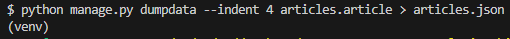
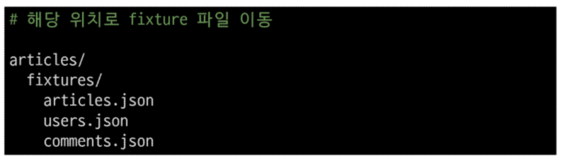

# 팔로우 기능 구현
### 프로필 페이지
* 각 회원의 개인 프로필 페이지에 팔로우 기능을 구현하기 위해 프로필 페이지를 먼저 구현하기
### 프로필 구현 (1/5)
url 작성
```py
# accounts/urls.py

urlpatterns = [
  ...
  path('profile/<username>/',views.profile, name='profile'),
]
```
### 프로필 구현 (2/5)
view 함수 작성
```py
# accounts/view.py

from django.contrib.auth import get_user_model

def profile(request,username):
    User = get_user_model()
    person = User.objects.get(username = username)
    context = {
        'person':person,
    }
    return render(request,'accounts/profile.html',context)
```
### 프로필 구현 (3/5)
profile 템플릿 작성
```html
<!-- accounts/profile.html -->
<h1>{{person.username}}님의 프로필 페이지</h1>

  <h2>{{person.username}}님이 작성한 게시글</h2>
  
    <div>{{article.title}}</div>
  

  <h2>{{person.uername}}님이 작성한 댓글</h2>
  
    <div>{{comment.content}}</div>
  
```
### 프로필 구현 (4/5)
프로필 페이지로 이동할 수 있는 링크 작성
```html
<!-- articles/index.html -->
    <a href=" ">내 프로필</a>
     작성자: 
      <a href="">{{ article.user }}</a>
```
### 프로필 구현 (5/5)
프로필 페이지 결과 확인
## 기능 구현
### User(M) - User(N)
0명 이상의 회원은 0명 이상의 회원과 관련
* 회원은 0명 이상의 팔로워를 가질 수 있고, 0명 이상의 다른 회원들을 팔로잉 할 수 있음
### 기능 구현(1/6)
* ManyToManyField 작성
```py
# accounts/models.py

class User(AbstractUser):
  followings = models.ManyToManyField('self', symmetrical = False, related_name = 'followers')
```
* 참조
  - 내가 팔로우하는 사람들 (팔로잉, followings)
* 역참조
  - 상대방 입장에서 나는 팔로워 중 한 명 (팔로워, followers)
* 바뀌어도 상관 없으나 관계 조회 시 생각하기 편한 방향으로 정한 것
### 기능 구현 (2/6)
Migrations 진행 후 중개 테이블 확인
### 기능 구현 (3/6)
url 작성
```py
# accounts/urls.py

urlpatterns = [
  ...,
  path('<int:user_pk>/follow/',views.follow,name='follow'),
]
```
### 기능 구현 (4/6)
view 함수 작성
```py
# accounts/views.py
def follow(request,user_pk):
    me = request.user
    you = get_user_model().objects.get(pk=user_pk)
    
    # 자기 자신을 팔로우 할 수 없음
    if me !=you:
        # 요청하는 사람이 상대방의 팔로워 목록에 있는지 없는지
        if me in you.followers.all():
            you.followers.remove(me)
        else:
            you.followers.add(me)
    return redirect('accounts:profile',you.username)
```
### 기능 구현 (5/6)
프로필 유저의 팔로잉, 팔로워 수 & 팔로우, 언팔로우 버튼 작성
```html
<!-- accounts/profile.html -->
<div>
    팔로잉 : {{person.followings.all|length}} / 팔로워 : {{person.followers.all|length}}
  </div>  
  
  <div>
    <form action="" method = "POST">
      
      
        <input type="submit" value = '언팔로우'>
      
        <input type="submit" value= '팔로우'>
      
    </form>
  </div>
  
```
### 기능 구현 (6/6)
팔로우 버튼 클릭 -> 팔로우 버튼 변화 및 중개 테이블 데이터 확인
### .exists()
QuerySet에 결과가 포함되어 있으면 True를 반환하고 결과가 포함되어 있지 않으면 False를 반환

* 큰 QuerySet에 있는 특정 객체 검색에 유용
## Fixtures
Django가 데이터베이스로 가져오는 방법을 알고 있는 데이터 모음
* 데이터는 데이터베이스 구조에 맞춰 작성 되어있음
### 초기 데이터 제공
Fixtures의 사용 목적
### 초기 데이터의 필요성
* 협업하는 유저 A,B가 있다고 생각해보기
  1. A가 먼저 프로젝트를 작업 후 원격 저장소에 push 진행
  * gitignore로 인해 DB는 업로드하지 않기 때문에 A가 생성한 데이터도 업로드 x
  2. B가 원격 저장소에서 A가 push한 프로젝트를 pull (혹은 clone)
  * 결과적으로 B는 DB가 없는 프로젝트를 받게 됨
* 이처럼 프로젝트의 앱을 처음 설정할 때 동일하게 준비 된 데이터로 데이터베이스를 미리 채우는 것이 필요한 순간이 있음
* Django에서는 Fixtures를 사용해 앱에 초기 데이터(initial data)를 제공
### Fixtures 활용
* M:N 까지 모두 작성된 Django 프로젝트에서 유저, 게시글, 댓글 등 각 데이터를 최소 2~3개 이상 생성해두기
### fixtures 관련 명령어
#### dumpdata : 생성(데이터 추출)
#### loaddata : 로드(데이터 입력)
### dumpdata : 데이터베이스의 모든 데이터를 추출

### loaddata
Fixtures 데이터를 데이터베이스로 불러오기
### Fixtures 파일 기본 경로
app_name/fixtures/
* Django는 설치된 모든 app의 디렉토리에서 fixtures 폴더 이후의 경로로 fixtures 파일을 찾아 load
### loaddata 활용 (1/2)
db.sqlite3 파일 삭제 후 migrate 진행

### loaddata 활용 (2/2)
load 진행 후 데이터가 잘 입력되었는지 확인
`$ python manage.py loaddata articles.json users.json comments.json`
### loaddata 순서 주의사항
* 만약 loaddata를 한번에 실행하지 않고 별도로 실행한다면 모델 관계에 따라 load 순서가 중요할 수 있음
  - comment는 article에 대한 key 및 user에 대한 key가 필요
  - article은 user에 대한 key가 필요
* 즉, 현재 모델 관계에서는 user -> article -> comment 순으로 data를 load 해야 오류가 발생하지 않음
### Fixtures 파일을 직접 만들지 말 것
반드시 dumpdata 명령어를 사용하여 생성
## Improve Query
* 같은 결과를 얻기 위해 DB 측에 보내는 query 개수를 점차 줄여 조회
### annotate
SQL의 GROUP BY를 사용
* 문제 원인
  - 각 게시글마다 댓글 개수를 반복 평가
```html
<!-- index_1.html -->
<p>댓글개수 : {{article.comment_set.cont}} </p>
```
### annotate 적용
* 문제 해결
  - 게시글을 조회하면서 댓글 개수까지 한번에 조회해서 가져오기
```py
def index_1(request):
    # articles = Article.objects.order_by('-pk')
    articles = Article.objects.annotate(Count('comment')).order_by('-pk')
    context = {
        'articles': articles,
    }
    return render(request, 'articles/index_1.html', context)
```
```html
<!-- index_1.html -->
    <p>댓글개수 : {{ article.comment__count }}</p>
<!-- query 한개로 가능 -->
```
### select_related
SQL의 INNER JOIN 사용
* 1:1 또는 N:1 참조 관계에서 사용
* 문제 원인
  - 각 게시글마다 작성한 유저명까지 반복 평가
```html
<!-- index_2.html -->
  
    <h3>작성자 : {{ article.user.username }}</h3>
    <p>제목 : {{ article.title }}</p>
    <hr>
  
```
### select_related 적용
* 문제 해결
  - 게시글을 조회하면서 유저 정보까지 한번에 조회해서 가져오기
```py
# views.py
def index_2(request):
    # articles = Article.objects.order_by('-pk')
    articles = Article.objects.select_related('user').order_by('-pk')
    context = {
        'articles': articles,
    }
    return render(request, 'articles/index_2.html', context)
```
### prefetch_related
M:N 또는 N:1 역참조 관계에서 사용
* SQL이 아닌 Python을 사용한 JOIN 진행
* 문제 원인
  - 각 게시글 출력 후 게시글의 댓글 목록까지 개별적으로 모두 평가
```html
<!-- index_3.html -->
   
      <p>{{ comment.content }}</p>
    
```
### prefetch_related 적용
* 문제 해결
  - 게시글을 조회하면서 참조된 댓글까지 한번에 조회해서 가져오기
```py
# views.py
def index_3(request):
    # articles = Article.objects.order_by('-pk')
    articles = Article.objects.prefetch_related('comment_set').order_by('-pk')
    context = {
        'articles': articles,
    }
    return render(request, 'articles/index_3.html', context)

```
### select_related & prefetch_related
* 문제 원인
  - "게시글" + "각 게시글의 댓글 목록" + "댓글의 작성자"를 단계적으로 평가
### prefetch_related 적용
* 문제 해결 1단계
  - 게시글을 조회하면서 참조된 댓글까지 한번에 조회
```py
# views.py
def index_4(request):
    # articles = Article.objects.order_by('-pk')
    # articles = Article.objects.prefetch_related('comment_set').order_by('-pk')
    articles = Article.objects.prefetch_related(
        Prefetch('comment_set', queryset=Comment.objects.select_related('user'))
    ).order_by('-pk')

    context = {
        'articles': articles,
    }
    return render(request, 'articles/index_4.html', context)

```